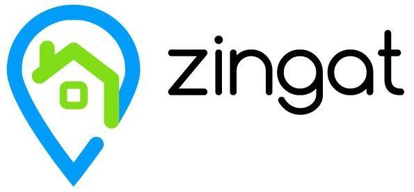
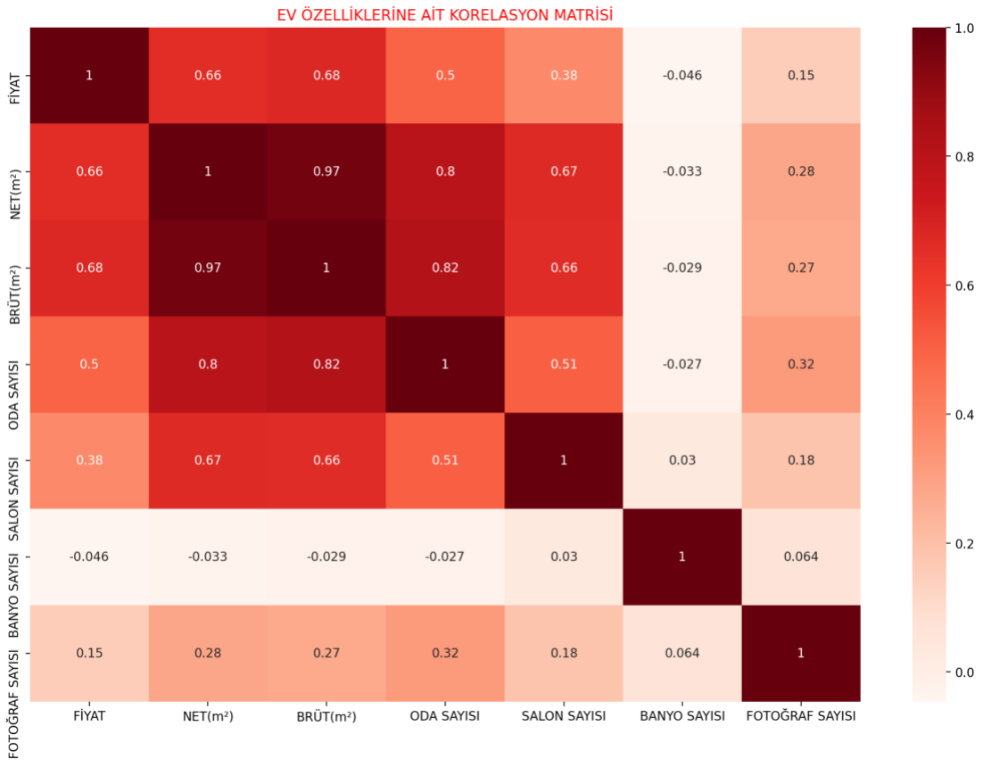
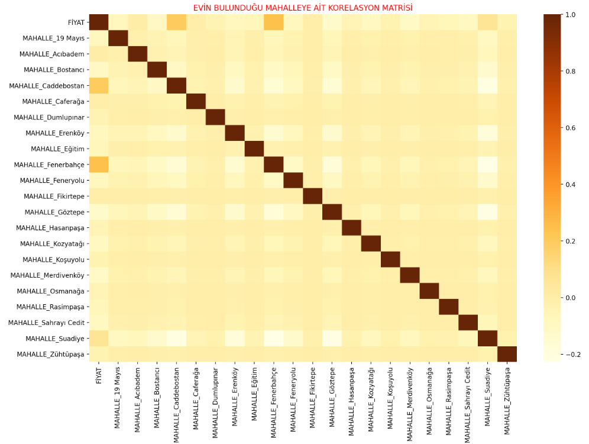
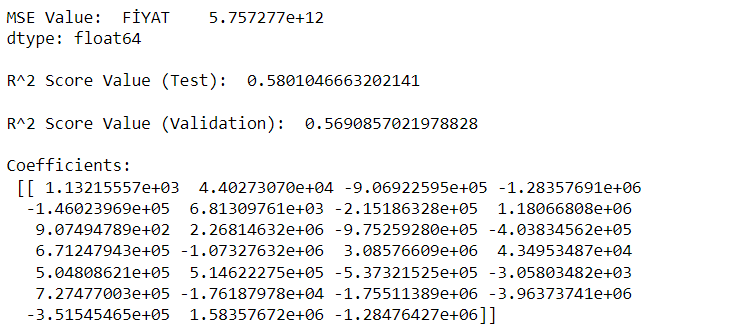

# House Price Prediction using Regression with Web Scraping BeautifulSoup

This repository includes a web scraping application, EDA analysis and regression solution for the house prices in Istanbul, Kadıköy.

## Introduction

**Problem Definition:** Which features affect the house price and can we make aprice estimation using these features in the Kadıköy?

**Solution Recommendation:** Developing regression models with the data obtained byusing the web scraping technique from Zingat

**Objective:** Finding the features that affect the price and the bestpossible regression model based on the importance of thefeatures that affect the house price

## Dataset

**Webpage:** https://www.zingat.com/

## Methodology

- Using the Python BeautifulSoup library, data collection for each post's features using the web scraping method

- Performing various editing and cleaning operations on the obtained data

- Performing exploratory data analysis on the cleaned data

- Finding the best regression model for our dataset to reach our aim

## Results

According to the analysis, the features that most positively affect the price of ahouse in Kadıköy are;
- The square meter of the house
- Number of rooms and living rooms of the house
- The house is located in Caddebostan or Fenerbahce

According to the analysis, the best regression method is shown;
- Linear Regression

